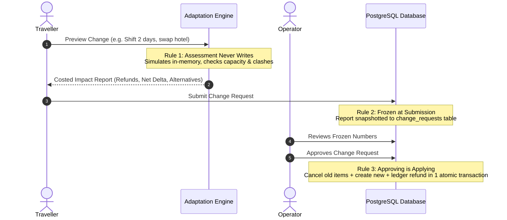

# 🧭 Tripzyy — Complete System & Technical Documentation

> **Version:** 1.0.0  
> **Platform:** Personalised and Dynamic Tour Planning & Operations  
> **Backend:** FastAPI (Python 3.12), SQLAlchemy 2.0 Async, PostgreSQL (Neon)  
> **Frontend:** Next.js 16 (App Router), React 19, TypeScript, Tailwind CSS v4  
> **AI Narration:** Groq (`openai/gpt-oss-120b`)

---

## 📑 Table of Contents
1. [Overview & Core Value Proposition](#1-overview--core-value-proposition)
2. [User Roles, Permissions & Accounts](#2-user-roles-permissions--accounts)
3. [End-to-End Platform Lifecycle](#3-end-to-end-platform-lifecycle)
4. [The Core Differentiator: Dynamic Adaptation Engine](#4-the-core-differentiator-dynamic-adaptation-engine)
5. [Database Architecture & Complete Schema (31 Tables)](#5-database-architecture--complete-schema-31-tables)
6. [API Architecture & Key Endpoints](#6-api-architecture--key-endpoints)
7. [Financial & Security Engineering Rules](#7-core-engineering-principles)
8. [Local Setup, Seeding & Test Verification](#8-local-setup-seeding--test-verification)

---

## 1. Overview & Core Value Proposition

Tripzyy is an end-to-end tour planning and operations platform designed around a fundamental reality of travel: **things rarely go entirely as planned**. 

Traditional booking engines sell static, rigid tour packages. When dates shift, flights are delayed, bad weather strikes, or an activity cancels, travellers face support nightmares while tour operators scramble to recalculate costs, check vendor availability, and issue refunds manually.

### The Tripzyy Solution
- **For Travellers:** Assemble completely personalized, modular trips out of swappable components (hotels, transfers, activities, and dining) backed by interactive maps, day-by-day scheduling, and real-time quotes.
- **For Tour Operators:** A robust operations console to manage customer rosters, vendor contracts, sellable inventory, scheduled departures, ground coordinators, and financial ledgers.
- **When Things Go Wrong:** A mathematical, deterministic **Adaptation Engine** calculates the impact of any change or regional disruption in real-time, checking capacity, cancellation terms, and replacements before executing the change in a single atomic database transaction.

---

## 2. User Roles, Permissions & Accounts

Tripzyy implements a **two-tier authorization model**:
1. **Global Platform Roles (`UserRole`):** Defined on the `users` table:
   - `ADMIN`: Platform administration and global management.
   - `USER`: Base role for all individuals (travellers, coordinators, and operators alike).
2. **Operator Roster Membership (`OperatorRole`):** Defined in `operator_members`:
   - `OWNER`: Business director with full authority over the operator's catalogue, staff, bookings, finances, and disruptions.
   - `MANAGER`: Senior staff managing inventory, departures, and approvals.
   - `COORDINATOR`: Field staff assigned to departures, handling traveller support threads and on-ground operations.

> **Zero-Trust Multi-Tenancy:** Access to operator features (`/operator/*`) requires an active membership on that operator's roster. No operator endpoint accepts an `operator_id` parameter; operator tenancy is strictly verified server-side via the authenticated user's JWT claims.

### Pre-Seeded Demo Accounts

These accounts are pre-seeded via `python -m app.seed.seed --demo`:

| Role | Name | Email | Password | Primary Interface & Responsibilities |
|---|---|---|---|---|
| **Platform Admin** | Aditi Sharma | `admin@tripzyy.com` | `Admin@123` | Platform oversight, system audit, user verification. |
| **Operator Owner** | Kabir Rao | `operator@tripzyy.com` | `Operate@123` | **Operator Console:** Full control over staff, inventory, bookings, schedule boards, and disruptions. |
| **Field Coordinator (Goa)** | Meera Iyer | `coordinator@tripzyy.com` | `Coord@123` | **Field Operations:** Assigned to departures, handles live traveller chat threads, resolves on-ground incidents. |
| **Field Coordinator (Jaipur)** | Arjun Desai | `coordinator2@tripzyy.com` | `Coord@123` | **Field Operations:** Secondary regional coordinator for North India departures. |
| **Primary Traveller** | Rahul Mehta | `traveller@tripzyy.com` | `Travel@123` | **Traveller App:** Owns the pre-built demo trip *"West Coast Run"* (Mumbai → Goa → Gokarna), manages bookings, checkout, and AI concierge. |
| **Explorer Traveller** | Priya Nair | `explorer@tripzyy.com` | `Explore@123` | **Traveller App:** Secondary traveller used for bill-splitting tests, group collaborations, and itinerary cloning. |

---

## 3. End-to-End Platform Lifecycle

Tripzyy connects 11 continuous stages in the travel lifecycle:

```
[Discover] ──► [Personalize] ──► [Plan] ──► [Price] ──► [Book] ──► [Prepare]
                                                                      │
[Review] ◄── [Complete] ◄── [Adapt] ◄── [Assist] ◄── [Operate] ◄──────┘
```

1. **Discover:** Search 40 destinations, 212 catalog activities, Google Places lookup, and explore public community itineraries for one-click cloning.
2. **Personalize:** Capture traveller style, pace, comfort tier (budget/standard/luxury), dietary preferences, and mobility requirements. (All preferences are nullable: unspecified $\ne$ no preference).
3. **Plan:** Multi-city itinerary creation with interactive Leaflet routing, day-by-day stops, and drag-and-drop activity reordering.
4. **Price:** Live, itemized quotes queried directly from vendor services and per-date availability with seasonal overrides.
5. **Book:** Bookings and booking items with a simulated payment gateway supporting authorizations, captures, installments, and partial refunds.
6. **Prepare:** Automatic PDF itinerary generation, packing checklists, and multi-traveller bill splitting.
7. **Operate:** Tour operator console featuring live schedule boards, group departures, coordinator assignments, and payments ledgers.
8. **Assist:** Bi-directional chat between traveller and coordinators, complemented by an AI concierge strictly grounded in the trip's booked data.
9. **Adapt:** Mid-trip adjustments, date changes, and emergency disruption handling via the deterministic adaptation engine.
10. **Complete:** Successful trip conclusion and archival.
11. **Review:** Verified reviews—only travellers with confirmed bookings for a component can submit a review. Scores feed directly back into the component recommendation ranker.

---

## 4. The Core Differentiator: Dynamic Adaptation Engine

When changes occur—a date moves, a guest drops out, or a cyclone closes a resort—Tripzyy executes a deterministic 3-phase adaptation flow.

### The Three Architectural Rules



1. **Assessment Never Writes:**  
   Simulating "what if I move this stay to Saturday?" evaluates the schedule in memory. It verifies vendor capacity in `service_availability`, computes snapshotted cancellation fees, and detects schedule clashes, then safely discards the simulation.
2. **The Report is Frozen at Submission:**  
   When submitted, the calculated impact report is frozen onto the `change_requests` row. Even if vendor prices fluctuate before review, the operator evaluates and approves the exact numbers the traveller agreed to.
3. **Approving IS Applying (Atomic Transaction):**  
   Approval executes the entire transition in one database transaction:
   - Old booking item is cancelled.
   - New booking item is created with a `replaced_by_item_id` audit reference.
   - Itinerary stops and activities are updated.
   - Price differences are credited or billed to the payments ledger.

### Guardrailed AI Narration
- **Deterministic Math:** Net deltas, refunds, and availability are computed exclusively by Python business logic.
- **Prose Narration Only:** Groq (`openai/gpt-oss-120b`) is used strictly to translate the technical impact report into plain-English summaries and power the conversational concierge.
- **Fail-Safe Fallback:** If the LLM is unreachable or rate-limited, the system falls back to a deterministic string template with zero disruption to financial or operational workflows.

---

## 5. Database Architecture & Complete Schema (31 Tables)

All tables inherit standard UUID primary keys and UTC timestamp tracking.

```
tripzyy_database/
├── 1. Identity & Auth (4 tables)
│   ├── users
│   ├── user_preferences
│   ├── otp_codes
│   └── revoked_tokens
│
├── 2. Supply & Operations (7 tables)
│   ├── operators
│   ├── operator_members
│   ├── vendors
│   ├── vendor_services
│   ├── service_availability
│   ├── tour_groups
│   └── tour_group_members
│
├── 3. Destinations & Planning (7 tables)
│   ├── destinations
│   ├── activity_catalog
│   ├── saved_destinations
│   ├── trips
│   ├── trip_stops
│   ├── trip_participants
│   └── itinerary_activities
│
├── 4. Bookings & Finance (3 tables)
│   ├── bookings
│   ├── booking_items
│   └── payments
│
├── 5. Dynamic Adaptation (2 tables)
│   ├── disruptions
│   └── change_requests
│
└── 6. Engagement, Logistics & Notes (8 tables)
    ├── itinerary_notes
    ├── support_threads
    ├── support_messages
    ├── reviews
    ├── expenses
    ├── expense_splits
    ├── logistics_checklists
    ├── checklist_items
    └── notifications
```

### Table Definitions & Key Attributes

#### 1. Identity & Auth
* **`users`**: Core user accounts. Lowercase unique email, hashed password, platform role (`admin`/`user`), active status, avatar URL.
* **`user_preferences`**: 1-to-1 with user. Preferred currency, travel style, pace, comfort tier, dietary restrictions, and mobility notes.
* **`otp_codes`**: Email verification OTPs with expiration timestamps and attempt limits.
* **`revoked_tokens`**: Stores JWT `jti` identifiers for invalidated tokens until their natural expiration.

#### 2. Supply & Operations
* **`operators`**: Operating companies coordinating personalized tours (name, slug, contact details, rating).
* **`operator_members`**: Links a user to an operator with a specific roster role (`owner`, `manager`, `coordinator`).
* **`vendors`**: External suppliers (hotels, transport, local tour companies) with calculated reliability scores (0–100).
* **`vendor_services`**: Bookable units (e.g., Deluxe King Room, AC Mini-Coach, Guided Heritage Walk). Contains base unit price, comfort tier, duration, and cancellation policies (`free_cancellation_days`, `cancellation_penalty_pct`).
* **`service_availability`**: Sparse per-date inventory tracking total capacity, booked capacity, seasonal price overrides, and maintenance blackout flags.
* **`tour_groups`**: Group departures sharing ground transport or a single coordinator.
* **`tour_group_members`**: Links individual bookings to a shared departure.

#### 3. Destinations & Planning
* **`destinations`**: Geographic destinations with coordinates, descriptions, and climate info.
* **`activity_catalog`**: Pre-seeded activity database categorized by style, estimated cost, and typical duration.
* **`saved_destinations`**: Traveller wishlists and bookmarks.
* **`trips`**: Master itinerary record holding dates, overall budget, party size, public share slug, and status (`draft`, `upcoming`, `completed`, `cancelled`).
* **`trip_stops`**: Ordered list of cities visited with arrival/departure dates.
* **`trip_participants`**: Collaborators invited to view or edit an itinerary.
* **`itinerary_activities`**: Scheduled activities tied to a stop, day, and time slot.
* **`itinerary_notes`**: Day-specific notes, recommendations, or packing reminders.

#### 4. Bookings & Finance
* **`bookings`**: Master reservation record with unique reference code, status (`draft`, `pending`, `confirmed`, `cancelled`), subtotal, discount, tax, and total.
* **`booking_items`**: The core operational unit. Links an itinerary stop/activity to a vendor service on a specific date. Snapshots the price, title, and cancellation terms at time of booking. Holds `replaced_by_item_id` for full audit trails.
* **`payments`**: Payment ledger tracking transaction type (`full`, `deposit`, `installment`, `refund`), status (`initiated`, `authorized`, `captured`, `refunded`, `failed`), gateway reference, and refund parent references.

#### 5. Dynamic Adaptation
* **`disruptions`**: Operational incidents scoped by city, date window, or specific service. Contains the initial blast-radius assessment and resolution timestamps.
* **`change_requests`**: Proposed itinerary modifications. Holds the proposal payload, frozen impact assessment JSON, AI narration, net cost delta, decision timestamps, and `applied_result` audit log.

#### 6. Engagement, Logistics & Billing
* **`support_threads`**: Customer care threads linking a trip/booking to the operator's coordinators.
* **`support_messages`**: Individual messages in a thread, flagged if authored by traveller, coordinator, or AI concierge.
* **`reviews`**: Verified traveller reviews with 1–5 star ratings. Refuses reviews unless the user holds a completed booking for that component.
* **`expenses` & `expense_splits`**: Split billing system calculating owed shares among trip participants.
* **`logistics_checklists` & `checklist_items`**: Interactive packing and preparation checklists.
* **`notifications`**: Real-time alerts for booking confirmations, schedule changes, and disruption warnings.

---

## 6. API Architecture & Key Endpoints

All endpoints are served under `/api/v1`.

### Standard Response Envelope
All API responses adhere to a consistent contract:
```json
{
  "success": true,
  "message": "Operation completed successfully",
  "data": { ... },
  "error": null
}
```

Standard machine-readable error codes include:
`VALIDATION_ERROR`, `UNAUTHORIZED`, `FORBIDDEN`, `NOT_FOUND`, `CONFLICT`, `RATE_LIMITED`, `SERVICE_UNAVAILABLE`, and `INTERNAL_ERROR`.

### Core API Endpoints

#### Dynamic Adaptation & Incidents
* `POST /trips/{id}/assess-change`: Calculates impact report in-memory without database writes (`?explain=true` includes Groq narration).
* `POST /trips/{id}/change-requests`: Submits change request, permanently freezing the impact report.
* `GET /trips/{id}/conflicts`: Continuous health check detecting schedule overlap, missing transfers, or stranded hotels.
* `POST /operator/change-requests/{id}/decision`: Approves, counters, or rejects a change request. Approval automatically executes the change atomically.
* `POST /operator/disruptions`: Raises a disruption incident and calculates its blast radius.
* `POST /operator/disruptions/{id}/items/{item_id}/recover`: Executes ranked replacement swap for an affected booking item.

#### Traveller Support & Verified Reviews
* `POST /trips/{id}/assist`: Submits a question to the AI concierge, grounded on trip data.
* `POST /operator/assist/{id}/messages`: Coordinator response to a traveller inquiry.
* `POST /reviews`: Submits a verified review for a completed booking item.
* `GET /reviews/pending`: Lists completed booking items awaiting review.
* `GET /reviews/{subject}/{target_id}`: Retrieves public review listing and rating distribution.

---

## 7. Core Engineering Principles

1. **Exact Financial Arithmetic:**  
   Money is never stored or transmitted as IEEE 754 floating-point numbers. In PostgreSQL, amounts are stored as `Numeric(12, 2)`. In Python, they are handled with the `Decimal` type. Across JSON APIs, amounts are serialized as exact strings (`"40000.00"`).
2. **Cancellation Policy Snapshotting:**  
   Vendor cancellation policies (`free_cancellation_days`, `cancellation_penalty_pct`) are snapshotted onto `booking_items` at purchase. Refunds are calculated strictly against the policy agreed to at purchase, regardless of future vendor updates.
3. **Prepared Statement Compatibility on Neon:**  
   Neon utilizes PgBouncer transaction pooling. Since PgBouncer does not support `asyncpg` prepared-statement caching across pooled connections, statement caching is explicitly disabled in the SQLAlchemy engine configuration.
4. **Isolated Test Schemas:**  
   The test suite utilizes SQLAlchemy's `schema_translate_map` to run against a dedicated `tripzyy_test` schema within the Neon instance, guaranteeing automated tests cannot mutate or wipe public data.
5. **Soft Trip Deletion:**  
   Trips utilize soft deletion (`deleted_at`). The row persists to preserve historical analytics and cloned trip relationships.

---

## 8. Local Setup, Seeding & Test Verification

### Prerequisites
- Python 3.12+
- Node.js 20+
- A Neon PostgreSQL connection string

### 1. Backend Setup
```bash
cd backend
python -m venv .venv

# Windows activation:
./.venv/Scripts/python.exe -m pip install -r requirements.txt
# macOS/Linux activation:
# source .venv/bin/activate && pip install -r requirements.txt

# Environment configuration
cp .env.example .env
# Edit .env and set:
# DATABASE_URL=postgresql+asyncpg://<user>:<password>@<neon-host>/<dbname>?sslmode=require
# SECRET_KEY=<generate with: python -c "import secrets; print(secrets.token_urlsafe(48))">
# GROQ_API_KEY=<your-optional-groq-key>

# Run database migrations and seed demo data
python -m alembic upgrade head
python -m app.seed.seed --demo

# Start the development server
python -m uvicorn app.main:app --reload
```
*Interactive Swagger API Docs:* `http://127.0.0.1:8000/docs`

### 2. Frontend Setup
```bash
cd frontend
npm install
cp .env.local.example .env.local
# Verify NEXT_PUBLIC_API_URL=http://localhost:8000/api/v1
npm run dev
```
*Application UI:* `http://localhost:3000`

### 3. Automated End-to-End Test Suite
Tripzyy includes comprehensive integration and simulation check scripts:
```bash
# Verify core traveller booking and payment pipeline
python scripts/e2e_check.py

# Verify the dynamic adaptation engine (57 assertions)
python scripts/adaptation_check.py

# Verify AI assist threads and verified reviews (29 assertions)
python scripts/engagement_check.py

# Run backend pytest suite (458 unit & service tests)
pytest
```
